Département Mathématiques et Informatique

Filière : II-BDCC

Introduction générale

Avec l’évolution rapide des systèmes d’information et l’augmentation des exigences en matière de performance, de scalabilité et de maintenabilité, les architectures monolithiques deviennent rapidement limitées. Les architectures micro-services, associées à une approche orientée événements, constituent une solution efficace pour répondre à ces défis. Dans ce contexte, ce projet consiste à concevoir et développer un système distribué basé sur les micro-services en respectant les patterns **CQRS** et **Event Sourcing**.

1- Architecture technique du projet

L’architecture repose sur plusieurs micro-services indépendants et faiblement couplés. Chaque domaine métier (produits, commandes, analyse) est isolé dans un service, ce qui améliore la maintenabilité et facilite l’évolution du système. Les services techniques (découverte et passerelle) assurent le routage et l’intégration entre les composants.
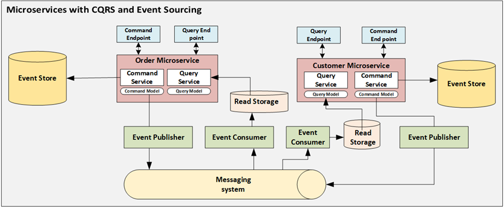
2- Diagramme de classe global

La modélisation met en évidence la séparation entre le modèle de commande et le modèle de lecture. Les **Aggregates** encapsulent les règles métier, les **commandes** déclenchent des changements d’état et ces changements sont représentés par des **événements**. Les modèles de lecture (projections) sont optimisés pour répondre rapidement aux requêtes.
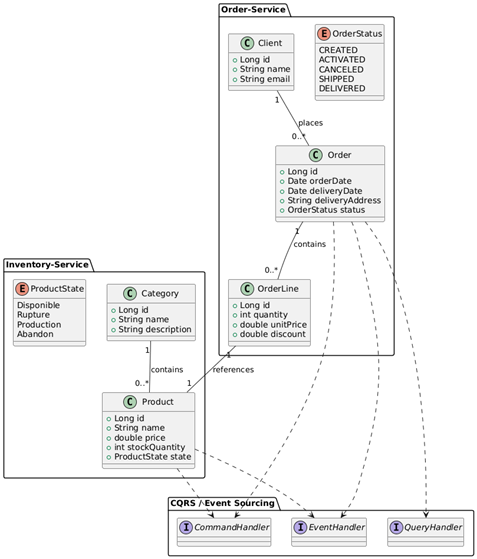
3- Déploiement d’Axon Server et Kafka

Axon Server constitue le cœur de l’architecture événementielle en assurant la persistance des événements et le routage des messages. Kafka Broker est utilisé pour la diffusion d’événements à grande échelle et le découplage entre producteurs et consommateurs, notamment pour l’intégration de traitements analytiques.

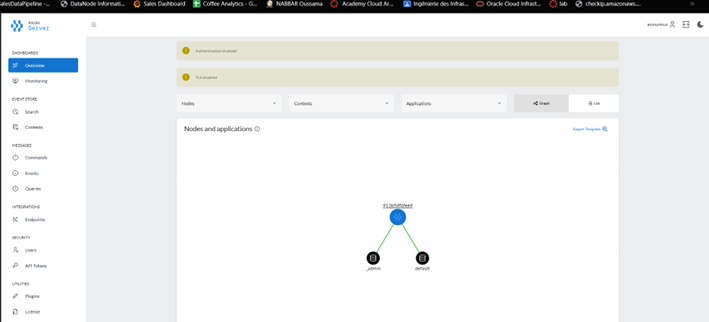
4- Inventory-Service

Le micro-service Inventory-Service gère les produits (et leurs informations associées). La partie commande applique les règles métier et produit des événements, tandis que la partie query maintient un modèle de lecture synchronisé permettant la consultation efficace des données.
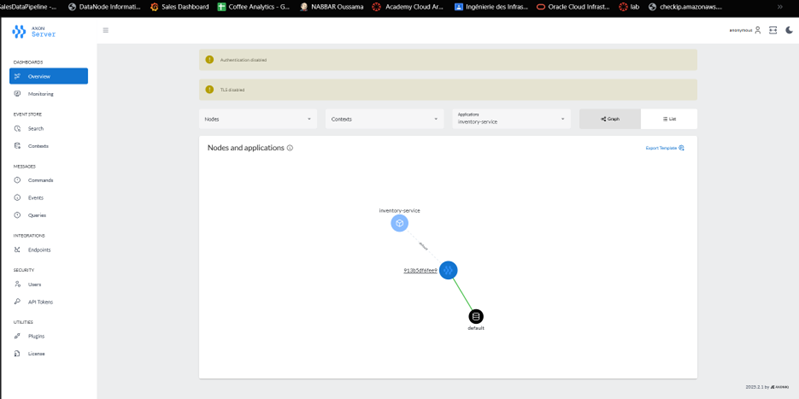
5- Order-Service

Le micro-service Order-Service est responsable de la gestion du cycle de vie des commandes. Les opérations de création et de mise à jour sont traitées via la partie commande, tandis que la partie query expose une vue de lecture adaptée aux besoins de consultation. Les événements générés assurent une traçabilité complète des changements.
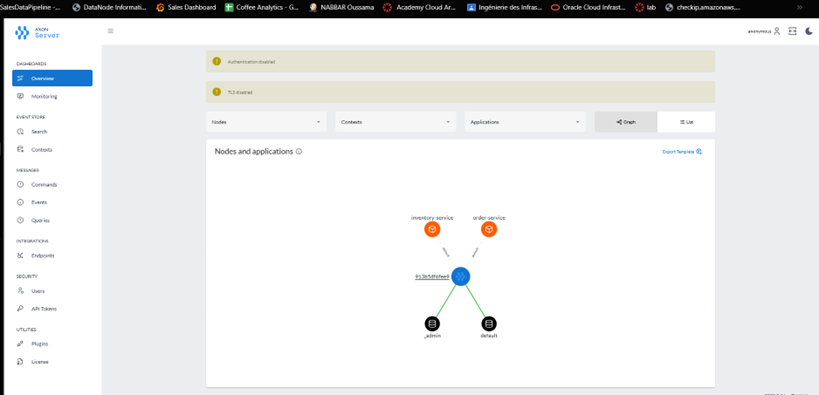
6- Mise en place des services techniques

Les services techniques supportent l’architecture micro-services. Le service de découverte permet l’enregistrement et la localisation dynamique des services, et l’API Gateway centralise l’accès en tant que point d’entrée unique. Cette organisation améliore la flexibilité, la scalabilité et la cohérence de l’ensemble du système.
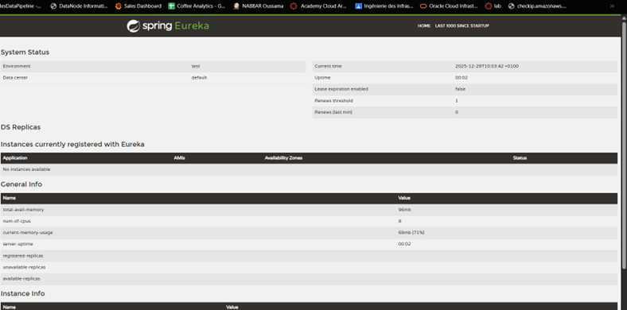
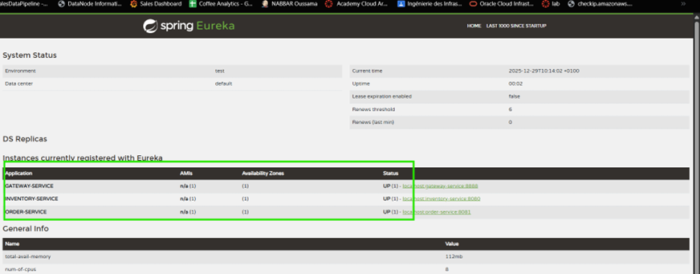
7- Micro-service d’analyse des données en temps réel

Un micro-service d’analyse temps réel a été mis en place afin d’exploiter les événements publiés. À l’aide de traitements en streaming, il calcule des indicateurs (par exemple le nombre total de commandes et le montant global) sur des fenêtres temporelles, puis expose ces résultats pour permettre une visualisation de l’activité du système sans perturber les services métier.
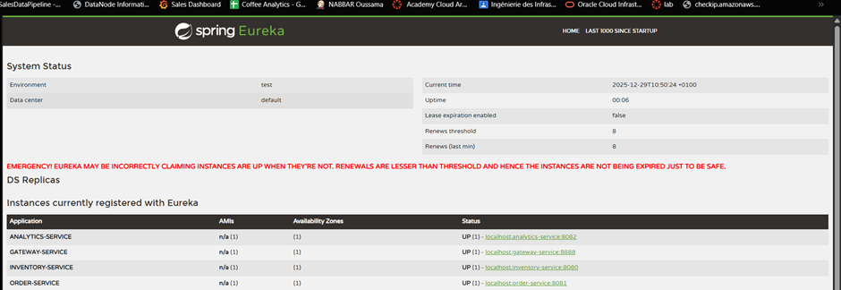
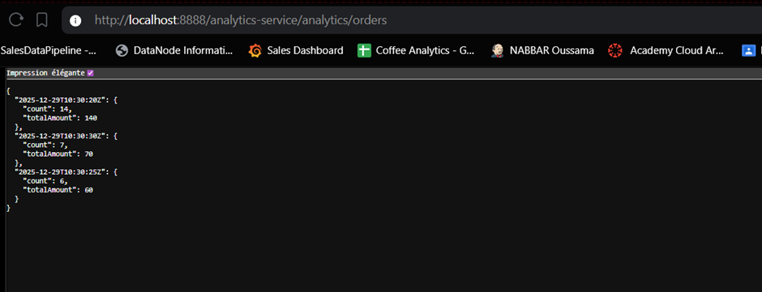
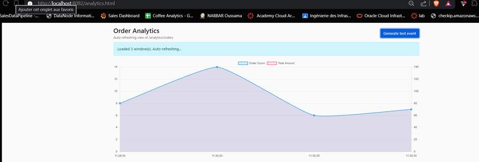
10- Déploiement avec Docker Compose

Le déploiement du système s’effectue via Docker Compose pour démarrer les composants d’infrastructure et faciliter l’exécution locale. Cette approche rend le déploiement reproductible, simplifie les tests et constitue une base adaptée à une mise en production.
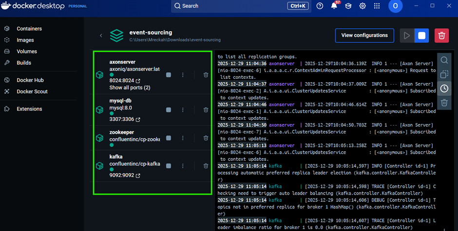
Conclusion

Ce projet met en œuvre une architecture micro-services moderne basée sur **CQRS** et **Event Sourcing**. La séparation Command/Query, l’exploitation des événements, et l’intégration d’un traitement analytique démontrent une approche orientée événements robuste, scalable et maintenable.
